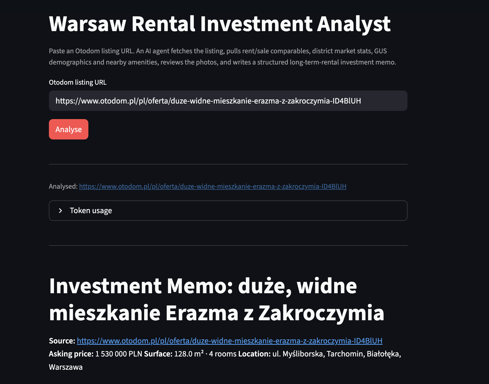
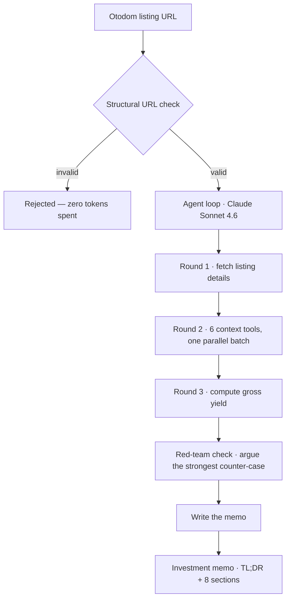

# Warsaw Rental Investment Analyst

[](https://realestate-agent.streamlit.app/)
[](https://github.com/khalidAlfozan/realestate-agent/actions/workflows/ci.yml)
[](https://github.com/khalidAlfozan/realestate-agent/actions/workflows/codeql.yml)


**Live demo:** [realestate-agent.streamlit.app](https://realestate-agent.streamlit.app/) — password-gated.

Paste an [Otodom](https://www.otodom.pl) listing URL and get back a structured
long-term-rental investment memo — yield analysis, rent and sale comparables,
district demographics, nearby-amenity context, NBP market-report context, a
photo-based condition review, and a Buy / Walk / Borderline recommendation with
a confidence score. Half a
day of analyst work compressed into a few minutes.

It is a hand-rolled Claude agent: a tool-use loop built directly on the
Anthropic SDK — no agent framework — that calls eight deterministic tools to
gather data and then writes the memo.



## How it works



1. **Validate.** The URL is checked structurally before anything else — a bad
   paste is rejected without constructing the API client or spending a token.
2. **Drive the loop.** Claude Sonnet 4.6 runs a hand-rolled tool-use loop —
   three tool-call rounds (fetch the listing, pull every context tool in one
   parallel batch, compute the gross yield), then an explicit **red-team
   check** that argues the strongest case against the preliminary verdict
   before committing to it, then the memo itself.
3. **Run tools concurrently.** The round-2 tools are independent and I/O-bound,
   so the loop runs them on a thread pool — the batch costs the slowest tool,
   not the sum.
4. **Write the memo.** The agent's final output is the memo — a leading
   **TL;DR** block (verdict, gross yield, key driver, and a fair-value counter
   for Walks) on top of an eight-section markdown body, emitted with no
   preamble.

## The investment memo

Every run produces the same structure: a leading **TL;DR** block — verdict,
gross yield, the single key driver, and a fair-value counter for Walks — on
top of an eight-section markdown body:

1. **Property summary** — what it is, when built, ownership form, heating
2. **Neighbourhood context** — district character, GUS demographics, nearby amenities
3. **Market backdrop** — where the Warsaw market sits in the price/rent cycle, from NBP reports
4. **Condition assessment** — photo-derived, cross-checked against the seller's claims
5. **Comparables** — rentals and sales, with district-wide baselines
6. **Financial analysis** — gross yield (from the tool) and net yield after the community fee
7. **Risks and sensitivities** — vacancy, supply pressure, ownership-form liquidity, condition surprises
8. **Recommendation** — Buy / Walk / Borderline, with a confidence score and a fair-value counter

A full run is in **[`examples/sample-memo.md`](examples/sample-memo.md)** — a
1959 Wola flat that opens with:

> **TL;DR**
> - **Verdict:** Borderline (Medium confidence).
> - **Gross yield:** 5.37% — at the low end of the typical 5–7% range.
> - **Key driver:** Net yield after czynsz collapses to 4.50%, and three structural features — ground floor, 1959 build, and limited (co-op) ownership — each independently compress rent-pricing power and resale liquidity; together they turn a location- and condition-strong asset into a thin-margin deal at the asking price.
> - *(Fair value counter: would be a Buy at approx. 1.15M PLN, where gross yield clears 6.0% and net yield approaches 5.1%.)*

## The tools

| Tool | What it does | Source |
|---|---|---|
| `get_property_details` | Scrapes the listing — price, m², rooms, floor, build year, ownership form, community fee, heating, coordinates, photos | Otodom |
| `find_comparable_properties` | Similar listings (rooms ±1, surface ±20%) for rent **or** sale; median / p25 / p75 PLN/m². Called twice — rent and sale | Otodom |
| `get_district_market_stats` | District-wide rent + sale baseline (median / p25 / p75 PLN/m²) and active-listing counts as a supply signal | Otodom |
| `get_district_demographics` | Population, dwellings, net migration, area, new-dwelling rate, businesses per 1,000 residents | GUS BDL |
| `get_nearby_amenities` | Subway / tram / bus / school / park counts and nearest examples, by walking distance from the property | OpenStreetMap |
| `search_market_reports` | Semantic search over NBP housing-market reports — quarterly home-price reports and working papers — for macro context | NBP corpus |
| `analyse_listing_photos` | Multimodal condition / renovation assessment and red flags | Claude Haiku 4.5 |
| `calculate_gross_yield` | Gross-yield arithmetic — done in Python, never left to the model | — |

## Data sources

| Source | Used for | Access |
|---|---|---|
| **Otodom** | Listing details, comparables, district market stats | HTML scrape (`__NEXT_DATA__`); no key |
| **GUS BDL** — Bank Danych Lokalnych, the Polish Central Statistical Office | District demographics | REST API; free `X-ClientId` key |
| **OpenStreetMap Overpass** | Nearby transit, schools, parks | REST API; no key |
| **NBP reports** — National Bank of Poland housing-market reports & working papers | Market-backdrop retrieval (RAG) | Pre-ingested into Postgres / pgvector; Voyage embeddings (key) |
| **Anthropic API** | The agent loop and the vision sub-call | API key |

## Market-report retrieval (RAG)

The `search_market_reports` tool is backed by a retrieval layer over a corpus
of National Bank of Poland (NBP) publications — quarterly housing-market
reports (2021–2024) and analytical working papers on price cycles, the rental
market, and housing-bubble risk. It gives the memo's **Market backdrop**
section macro grounding the per-listing tools can't provide.

- **Ingestion** — `uv run python -m src.rag.ingest` reads the report PDFs,
  extracts text, splits it into overlapping chunks, embeds them with
  [Voyage](https://voyageai.com) (`voyage-3.5`), and stores the vectors in a
  Postgres + [pgvector](https://github.com/pgvector/pgvector) database. It is
  idempotent and run once, not per-analysis.
- **Retrieval** — at analysis time the tool embeds the agent's query the same
  way and returns the nearest chunks by cosine distance, over an HNSW index.

Ingestion is a separate local step; the deployed app only does retrieval, so it
needs `DATABASE_URL` and `VOYAGE_API_KEY` set. See [`src/rag/`](src/rag).

## Quickstart

**Prerequisites:** Python 3.13 and [uv](https://docs.astral.sh/uv/).

```bash
# 1. Install dependencies (uv manages the virtualenv)
uv sync

# 2. Configure secrets
cp .env.example .env
#   - ANTHROPIC_API_KEY   (required)            https://console.anthropic.com/settings/keys
#   - GUS_BDL_API_KEY     (recommended, free)   https://api.stat.gov.pl/Home/BdlApi
#   - VOYAGE_API_KEY      (recommended, free)   https://dash.voyageai.com
#   - DATABASE_URL        (recommended)         pgvector Postgres — e.g. a free Neon database

# 3a. Run the web app
uv run streamlit run app.py

# 3b. ...or the CLI
uv run python -m src "https://www.otodom.pl/pl/oferta/<slug>-ID<id>"
```

`ANTHROPIC_API_KEY` is required. The rest are recommended: `GUS_BDL_API_KEY`
(free) powers district demographics; `VOYAGE_API_KEY` (free) and `DATABASE_URL`
power the market-backdrop retrieval — which also needs a one-off corpus
ingestion (see [Market-report retrieval](#market-report-retrieval-rag)). Without
any of these the agent marks that memo section unavailable rather than failing
the run. Otodom and OpenStreetMap need no key.

## Deployment

The app is deploy-ready for [Streamlit Community Cloud](https://share.streamlit.io):

1. Open **share.streamlit.io** and sign in with GitHub.
2. **New app** → pick this repo, branch `main`, main file `app.py`, Python 3.13.
3. Under **Secrets**, paste the TOML below with real values.
4. Deploy.

```toml
# Streamlit Community Cloud secrets — paste into the app's Settings -> Secrets.
ANTHROPIC_API_KEY = "sk-ant-..."        # required
GUS_BDL_API_KEY = "..."                 # recommended (free) — district demographics
VOYAGE_API_KEY = "..."                  # recommended (free) — market-report retrieval
DATABASE_URL = "postgresql://..."       # recommended — pgvector store for retrieval
APP_PASSWORD = "pick-a-strong-secret"   # gates the public app
```

A public deployment runs on your Anthropic key, so it is gated by a
**password**: when `APP_PASSWORD` is set, every visitor must enter it before
they can run an analysis. Unset — i.e. local dev — the gate is open.

## Eval harness

A ground-truth eval suite of **25 scored cases** across 14 Warsaw districts —
district tiers (central to outer), build eras (pre-war kamienica to 2025
new-build), sizes (studio to 4-room), seller types, and price tiers. The
harness:

- **Snapshots each case's tool I/O** to [`evals/snapshots/`](evals/snapshots),
  so a case re-runs deterministically against frozen inputs — only the agent
  LLM stays live. Re-running after a listing has delisted still works.
- **Grades each case** on verdict, yield band, tool coverage, and risk
  substrings ([`evals/parse_memo.py`](evals/parse_memo.py)).
- **Was the gate for the prompt-reasoning pass** ([#62](https://github.com/khalidAlfozan/realestate-agent/pull/62)–[#67](https://github.com/khalidAlfozan/realestate-agent/pull/67))
  — six reasoning levers tested with before/after numbers on all 25 cases
  per change; five kept, one reverted as an honest null result. Full
  methodology and results writeup:
  **[`docs/eval-methodology.md`](docs/eval-methodology.md)**.

Run it locally: `uv run python -m evals.run_evals`.

## Development

```bash
uv run ruff check src tests evals app.py           # lint
uv run ruff format --check src tests evals app.py  # formatting
uv run pyright                                     # type check
uv run deptry .                                    # dependency hygiene
uv run pytest -q                                   # tests + branch coverage
uv run python -m evals.run_evals                   # ground-truth eval harness
```

### Continuous integration

Every PR runs the checks below — see [`.github/workflows`](.github/workflows):

| Check | What it catches |
|---|---|
| `ruff check` | A broad rule set: style, imports, security (bandit), a cyclomatic-complexity ceiling, naming, datetime safety, magic numbers, commented-out code, logging correctness, and more |
| `ruff format --check` | Formatting drift |
| `pyright` | Type errors |
| `deptry` | Unused / missing / transitively-imported dependencies |
| `pytest --cov` | Tests + branch coverage; CI fails if total coverage drops below **90%** |
| `CodeQL` | GitHub-native security analysis (SAST); results in the **Security** tab; runs per-PR and weekly |

### Commit conventions

`main` is squash-merged, so the PR title becomes the commit message — and PR
titles are enforced as [Conventional Commits](https://www.conventionalcommits.org/)
by [`pr-title.yml`](.github/workflows/pr-title.yml). Format:
`<type>(<optional scope>): <subject>`, with types `feat`, `fix`, `refactor`,
`docs`, `test`, `chore`, `ci`, `build`, `revert`.

```
feat(tools): add get_district_demographics — GUS BDL dzielnica stats
refactor(agent): execute tool-call batches concurrently
fix(ui): name the agent, not the model, in the progress feed
```

## Project layout

```
.
├── app.py                    Streamlit entry point
├── src/
│   ├── agent.py              the hand-rolled tool-use loop
│   ├── cli.py                command-line entry point
│   ├── config.py             typed Settings (defaults < TOML < env vars)
│   ├── cost.py               per-run cost from a dated pricing snapshot
│   ├── models.py             Pydantic I/O models for the tools
│   ├── url_validation.py     structural Otodom-URL guard
│   ├── prompts/              the system prompt
│   ├── rag/                  market-report corpus — ingest + pgvector retrieval
│   └── tools/                the eight agent tools
├── data/                     NBP market-report corpus (PDFs)
├── docs/                     README assets
├── evals/                    ground-truth eval harness
├── examples/                 a sample investment memo
├── tests/                    test suite (CI-gated at 90% coverage)
└── realestate-agent.toml     project config — overrides Settings defaults
```

## Design notes

The decisions a reviewer might ask about:

- **Hand-rolled agent loop, no framework.** The loop — caching, concurrency,
  cost accounting, the tool registry — is the part worth owning and showing.
  No LangChain / LangGraph.
- **Concurrent tool execution.** The model emits tool calls in parallel
  batches; the loop honours that with a thread pool, so a batch's wall time is
  the slowest tool rather than the sum.
- **RAG: ingest once, query per run.** The NBP market-report corpus is
  chunked, embedded with Voyage, and stored in pgvector by a one-off,
  idempotent `src.rag.ingest` run — never in the request path. At analysis
  time the agent only does the read side (embed query, cosine-search), so the
  deployed app needs a Postgres connection, not a PDF pipeline.
- **OpenStreetMap, not the Warsaw city API.** `api.um.warszawa.pl` is
  geo-blocked outside Poland — unusable in CI or for anyone cloning the repo
  abroad. OSM has equivalent Warsaw coverage, is globally reachable, and needs
  no key.
- **Fail-soft tools.** A tool exception becomes an error string in the tool
  result, not a crashed loop — the agent surfaces it in the memo and continues.
  Missing GUS data becomes a null field and a skipped memo line.
- **Typed, layered configuration.** Pydantic Settings, resolved
  defaults < `realestate-agent.toml` < `RA_*` environment variables. Secrets
  live only in `.env` (gitignored), never in the config file.
- **Pricing snapshot with a staleness check.** Anthropic doesn't publish
  prices via API, so the cost table is hand-curated with a snapshot date that
  self-warns once it ages past six months.
- **Eval-gated prompt iteration.** When the system prompt needs to change, the
  25-case eval suite is the gate — each candidate change is measured against
  the baseline numbers before it ships. The methodology matters more than any
  single change.

## Roadmap

**Built:** the agent loop and all eight tools · CLI and Streamlit interfaces ·
RAG retrieval over a corpus of NBP market reports (pgvector + Voyage
embeddings) · a password-gated public deployment · per-run cost / token /
latency tracking · a **25-case ground-truth eval suite** with deterministic
tool-result snapshots · an **eval-gated prompt-reasoning pass** that tested
six levers with before/after numbers (five kept, one reverted) · agent
reliability fixes (Praga district slug, `max_tokens` handling, partial
snapshot writes) · typed configuration · CI with linting, type-checking,
dependency hygiene, coverage gating, and CodeQL.

**Next:** polish and deploy.

## Scope

Deliberately narrow — this is a focused v1, not a platform:

- **Single user.** One local instance; not multi-tenant.
- **Warsaw only.** District logic and data sources are Warsaw-specific.
- **Long-term residential rentals only.** No short-let, commercial, or land.
- **No agent framework and no fine-tuning** — off-the-shelf Claude models,
  prompting, and tools.

## License

[MIT](LICENSE)
