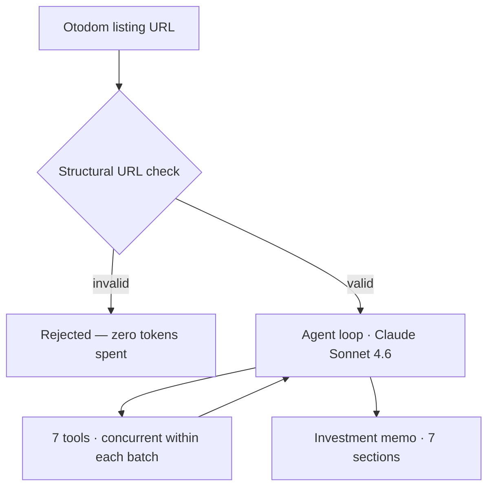

# Warsaw Rental Investment Analyst

[](https://github.com/khalidAlfozan/realestate-agent/actions/workflows/ci.yml)
[](https://github.com/khalidAlfozan/realestate-agent/actions/workflows/codeql.yml)


Paste an [Otodom](https://www.otodom.pl) listing URL and get back a structured
long-term-rental investment memo — yield analysis, rent and sale comparables,
district demographics, nearby-amenity context, a photo-based condition review,
and a Buy / Walk / Borderline recommendation with a confidence score. Half a
day of analyst work compressed into a few minutes.

It is a hand-rolled Claude agent: a tool-use loop built directly on the
Anthropic SDK — no agent framework — that calls seven deterministic tools to
gather data and then writes the memo.

## How it works



1. **Validate.** The URL is checked structurally before anything else — a bad
   paste is rejected without constructing the API client or spending a token.
2. **Drive the loop.** Claude Sonnet 4.6 runs an Anthropic tool-use loop. Each
   turn it requests a batch of tool calls; the loop executes them and feeds the
   results back.
3. **Run tools concurrently.** Tools in a batch are independent and I/O-bound,
   so they run on a thread pool — a batch costs the slowest tool, not the sum.
4. **Write the memo.** Once the data is in, the agent produces a fixed
   seven-section markdown memo.

## The tools

| Tool | What it does | Source |
|---|---|---|
| `get_property_details` | Scrapes the listing — price, m², rooms, floor, build year, ownership form, community fee, heating, coordinates, photos | Otodom |
| `find_comparable_properties` | Similar listings (rooms ±1, surface ±20%) for rent **or** sale; median / p25 / p75 PLN/m². Called twice — rent and sale | Otodom |
| `get_district_market_stats` | District-wide rent + sale baseline (median / p25 / p75 PLN/m²) and active-listing counts as a supply signal | Otodom |
| `get_district_demographics` | Population, dwellings, net migration, area, new-dwelling rate, businesses per 1,000 residents | GUS BDL |
| `get_nearby_amenities` | Subway / tram / bus / school / park counts and nearest examples, by walking distance from the property | OpenStreetMap |
| `analyse_listing_photos` | Multimodal condition / renovation assessment and red flags | Claude Haiku 4.5 |
| `calculate_gross_yield` | Gross-yield arithmetic — done in Python, never left to the model | — |

## Data sources

| Source | Used for | Access |
|---|---|---|
| **Otodom** | Listing details, comparables, district market stats | HTML scrape (`__NEXT_DATA__`); no key |
| **GUS BDL** — Bank Danych Lokalnych, the Polish Central Statistical Office | District demographics | REST API; free `X-ClientId` key |
| **OpenStreetMap Overpass** | Nearby transit, schools, parks | REST API; no key |
| **Anthropic API** | The agent loop and the vision sub-call | API key |

## Quickstart

**Prerequisites:** Python 3.13 and [uv](https://docs.astral.sh/uv/).

```bash
# 1. Install dependencies (uv manages the virtualenv)
uv sync

# 2. Configure secrets
cp .env.example .env
#   - ANTHROPIC_API_KEY   (required)            https://console.anthropic.com/settings/keys
#   - GUS_BDL_API_KEY     (recommended, free)   https://api.stat.gov.pl/Home/BdlApi

# 3a. Run the web app
uv run streamlit run app.py

# 3b. ...or the CLI
uv run python -m src "https://www.otodom.pl/pl/oferta/<slug>-ID<id>"
```

`ANTHROPIC_API_KEY` is required. `GUS_BDL_API_KEY` is free and recommended: a
run still completes without it, but the agent reports the demographics as
unavailable and the memo's neighbourhood section is thinner. Otodom and
OpenStreetMap need no key.

## Deployment

The app is deploy-ready for [Streamlit Community Cloud](https://share.streamlit.io):

1. Open **share.streamlit.io** and sign in with GitHub.
2. **New app** → pick this repo, branch `main`, main file `app.py`, Python 3.13.
3. Under **Secrets**, paste the TOML below with real values.
4. Deploy.

```toml
# Streamlit Community Cloud secrets — paste into the app's Settings -> Secrets.
ANTHROPIC_API_KEY = "sk-ant-..."        # required
GUS_BDL_API_KEY = "..."                 # recommended (free) — district demographics
APP_PASSWORD = "pick-a-strong-secret"   # gates the public app
```

A public deployment runs on your Anthropic key, so it is gated by a
**password**: when `APP_PASSWORD` is set, every visitor must enter it before
they can run an analysis. Unset — i.e. local dev — the gate is open.

## The investment memo

Every run produces the same seven-section markdown template:

1. **Property summary** — what it is, when built, ownership form, heating
2. **Neighbourhood context** — district character, GUS demographics, nearby amenities
3. **Condition assessment** — photo-derived, cross-checked against the seller's claims
4. **Comparables** — rentals and sales, with district-wide baselines
5. **Financial analysis** — gross yield (from the tool) and net yield after the community fee
6. **Risks and sensitivities** — vacancy, supply pressure, ownership-form liquidity, condition surprises
7. **Recommendation** — Buy / Walk / Borderline, with a confidence score and a fair-value counter

## Development

```bash
uv run ruff check src tests evals app.py           # lint
uv run ruff format --check src tests evals app.py  # formatting
uv run pyright                                     # type check
uv run deptry .                                    # dependency hygiene
uv run pytest -q                                   # tests + branch coverage
uv run python -m evals.run_evals                   # ground-truth eval harness
```

### Continuous integration

Every PR runs the checks below — see [`.github/workflows`](.github/workflows):

| Check | What it catches |
|---|---|
| `ruff check` | A broad rule set: style, imports, security (bandit), a cyclomatic-complexity ceiling, naming, datetime safety, magic numbers, commented-out code, logging correctness, and more |
| `ruff format --check` | Formatting drift |
| `pyright` | Type errors |
| `deptry` | Unused / missing / transitively-imported dependencies |
| `pytest --cov` | Tests + branch coverage; CI fails if total coverage drops below **90%** |
| `CodeQL` | GitHub-native security analysis (SAST); results in the **Security** tab; runs per-PR and weekly |

### Commit conventions

`main` is squash-merged, so the PR title becomes the commit message — and PR
titles are enforced as [Conventional Commits](https://www.conventionalcommits.org/)
by [`pr-title.yml`](.github/workflows/pr-title.yml). Format:
`<type>(<optional scope>): <subject>`, with types `feat`, `fix`, `refactor`,
`docs`, `test`, `chore`, `ci`, `build`, `revert`.

```
feat(tools): add get_district_demographics — GUS BDL dzielnica stats
refactor(agent): execute tool-call batches concurrently
fix(ui): name the agent, not the model, in the progress feed
```

## Project layout

```
.
├── app.py                    Streamlit entry point
├── src/
│   ├── agent.py              the hand-rolled tool-use loop
│   ├── cli.py                command-line entry point
│   ├── config.py             typed Settings (defaults < TOML < env vars)
│   ├── cost.py               per-run cost from a dated pricing snapshot
│   ├── models.py             Pydantic I/O models for the tools
│   ├── url_validation.py     structural Otodom-URL guard
│   ├── prompts/              the system prompt
│   └── tools/                the seven agent tools
├── evals/                    ground-truth eval harness
├── tests/                    test suite (CI-gated at 90% coverage)
└── realestate-agent.toml     project config — overrides Settings defaults
```

## Design notes

The decisions a reviewer might ask about:

- **Hand-rolled agent loop, no framework.** The loop — caching, concurrency,
  cost accounting, the tool registry — is the part worth owning and showing.
  No LangChain / LangGraph.
- **Concurrent tool execution.** The model emits tool calls in parallel
  batches; the loop honours that with a thread pool, so a batch's wall time is
  the slowest tool rather than the sum.
- **OpenStreetMap, not the Warsaw city API.** `api.um.warszawa.pl` is
  geo-blocked outside Poland — unusable in CI or for anyone cloning the repo
  abroad. OSM has equivalent Warsaw coverage, is globally reachable, and needs
  no key.
- **Fail-soft tools.** A tool exception becomes an error string in the tool
  result, not a crashed loop — the agent surfaces it in the memo and continues.
  Missing GUS data becomes a null field and a skipped memo line.
- **Typed, layered configuration.** Pydantic Settings, resolved
  defaults < `realestate-agent.toml` < `RA_*` environment variables. Secrets
  live only in `.env` (gitignored), never in the config file.
- **Pricing snapshot with a staleness check.** Anthropic doesn't publish
  prices via API, so the cost table is hand-curated with a snapshot date that
  self-warns once it ages past six months.

## Roadmap

**Built:** the agent loop and all seven tools · CLI and Streamlit interfaces ·
per-run cost / token / latency tracking · a ground-truth eval harness · typed
configuration · CI with linting, type-checking, dependency hygiene, coverage
gating, and CodeQL.

**Next:** retrieval over a corpus of Polish market reports (pgvector + Voyage
embeddings — dependencies are installed, not yet wired) · public deployment ·
expanding the eval suite toward ~25 scored cases.

## Scope

Deliberately narrow — this is a focused v1, not a platform:

- **Single user.** One local instance; not multi-tenant.
- **Warsaw only.** District logic and data sources are Warsaw-specific.
- **Long-term residential rentals only.** No short-let, commercial, or land.
- **No agent framework and no fine-tuning** — off-the-shelf Claude models,
  prompting, and tools.

## License

[MIT](LICENSE)
